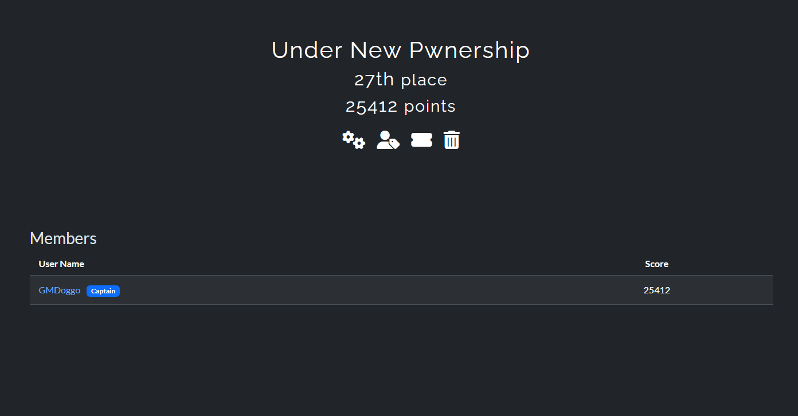

# About

This repository contains my personal write-up for **CTF@CIT 2025**, a Capture The Flag competition hosted by the Connecticut Institute of Technology (CIT). CTF@CIT featured a wide range of challenges across multiple categories and was open to the public.

## Timeframe

The competition was held over the weekend from April 25th @5pm EST to April 27th @3pm est. I spent hours solving challenges, digging through countless rabbit holes, and pushing my skills and googling to the limit.

## Results

Out of 950 registered teams, I placed **27th**, solving **33 out of 45 challenges** across all categories, which included:
- Crypto
- Forensics
- Reverse Engineering
- Steganography
- OSINT
- Web
- Miscellaneous

