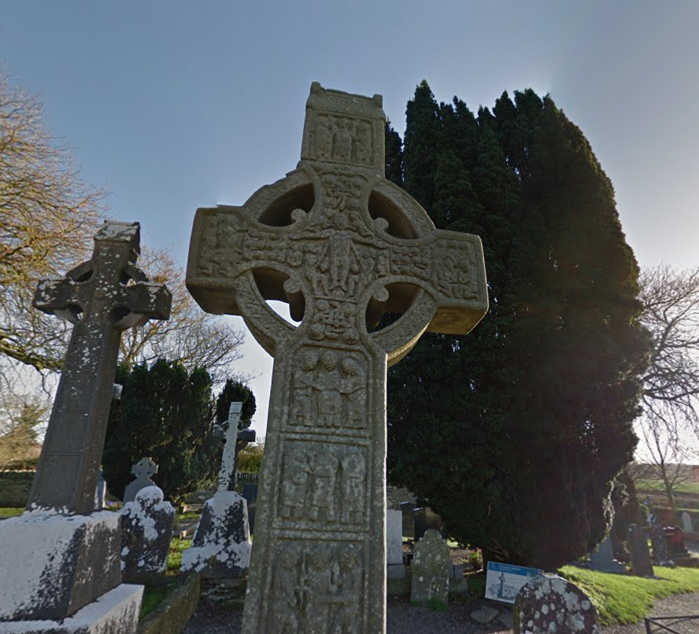

## Synopsis

In the twilight archives of Eldoria, Nyla studies an image of an ancient Celtic cross. Her enchanted crystals illuminate the intricate carvings as she searches through forgotten tomes. The cross stands at a crossroads of realms and time, its weathered surface telling tales older than Eldoria itself. As her magical threads of knowledge connect across centuries, the true name of the monument emerges in glowing script before her eyes. Another mystery solved by the realm's most skilled information seeker, who knows that even stone can speak to those who know how to listen.

## Description

Throughout history, many ancient Celtic crosses have been erected, each carrying cultural and religious significance. However, not all of them are the same. By analyzing the given image and searching carefully, you will find that this cross holds a name of great importance.

## Steps to Solve:

1. **Reverse-search** the image to locate its general historical site.
2. **Identify** the exact name of the cross by verifying similar images.

This task requires basic **OSINT** and **visual comparison** skills—spot the differences, confirm the location, and retrieve the name.


## Enumeration


### Step 1: Google Searching
`Nyla studies an image of an ancient Celtic cross`

Within the prompt we are given a fairly large hint. If we do a quick google search for Ancient Celtic Crosses and navigate to Images we see hundreds of similar looking crosses.

### Step 2: Identifying the Exact Cross

In images I found one similar but it did not have the name on the respective image, can be found [Here](https://www.myirishjeweler.com/blog/irish-celtic-cross-history/?srsltid=AfmBOormVU2F54Rfdui6VBJniQ-YBzO-pKlwJs2EyeadSDLA2MBulcWU). Navigating into the page we see the image is labeled The Muiredach Cross.


### Step 3: Confirm the Name

Since I tried submitting Muiredach Cross with no avail I had to do further enumeration to realize the real name/flag is Muiredach's High Cross.


## Flag Extraction

Once the exact name is confirmed, submit the flag in the following format:

```
HTB{Muiredachs_High_Cross}
```