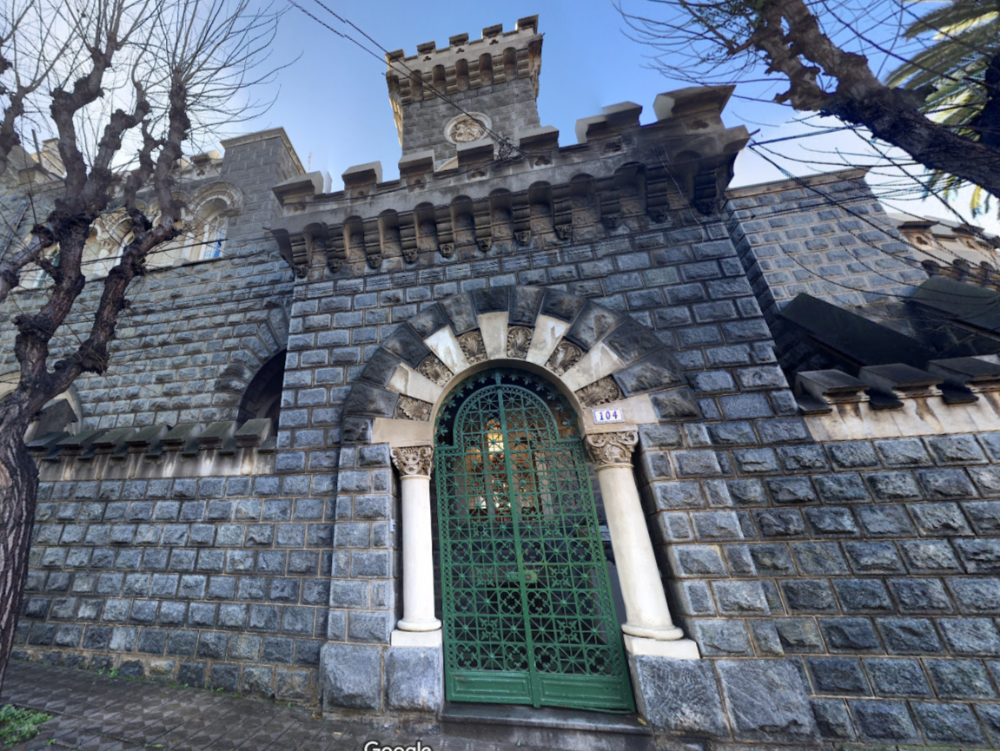

## Synopsis

Deep in her sanctum beneath Eldoria's streets, Nyla arranges seven crystalline orbs in a perfect circle. Each contains a different vision of stone battlements and weathered walls—possible matches for the mysterious fortress the Queen seeks in the southern kingdoms of Chile. The image in her central crystal pulses with ancient power, showing a majestic citadel hidden among the distant Chilean mountains. Her fingers dance across each comparison crystal, her enchanted sight noting subtle architectural differences between the visions. The runes along her sleeves glow more intensely with each elimination until only one crystal remains illuminated. As she focuses her magical threads on this final vision, precise location runes appear in glowing script around the orb. Nyla smiles in satisfaction as the fortress reveals not just its position, but its true name and history. A more challenging mystery solved by Eldoria's premier information seeker, who knows that even the most distant fortifications cannot hide their secrets from one who compares the patterns of stone and shadow.

## Description

You’ve been provided with an image of a majestic fortress in Latin America. The task is simple: reverse-search the image to begin your search for clues. Once you start searching, you’ll be directed to several castles, and you must check each one for any similarity to the structure in the image. The closer you get, the clearer the path will become.

## Solve

### Step 1 - Reverse Search 

I personally used [lenso.ai](https://lenso.ai/)for the reverse search and it gave me a hit with a new image to search.

### Step 2 - Further Searching

After getting the new image I reverse searched that and got a lot more options to choose from. That being said all of them contained the same name Castillo Brunet

