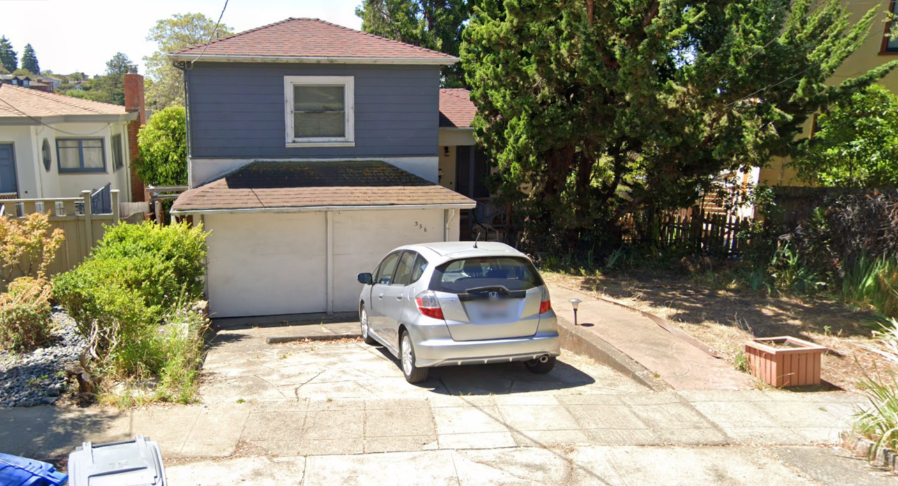

## Synopsis

Nyla stands before her largest crystal, hands weaving intricate patterns as she conjures an aerial view of the Western Hills district. A noble family's ancestral home must be located precisely—its entrance marked with a numerical rune that could unlock valuable diplomatic secrets. The crystalline vision floats above her palms, revealing winding roads and nestled dwellings along the hillsides. Her enchanted sight zooms closer as she traces the hidden pathways between estates. The magical markers on her map pulse brighter as she narrows her search, until finally, the numerical sigil above one particular doorway glows with confirmation. Another secret revealed by Eldoria's master information seeker, who knows that even among a thousand similar dwellings, each bears a unique magical signature for those with eyes to see.

## Description

You've received only a satellite image showing a house. Your task is to pinpoint its exact location using only the image and the hints embedded in this challenge description.

## Solve

Our solve was a bit of luck and a bit of reading the prompt for hidden clues. Essentially based on the prompt's key words of mentioning the Western Hills and the hillsides, my brain instantly jumped to California.

Following dropping into street view of California I checked other cars in the area I dropped in to see if the license plate was somewhat similar

After that we essentially just started hammering google searches of Hills Area or regions within California. I don't remember our exact prompt but it was something along the lines of "Hill Side Regions of California" and the Google AI Overview happened to give us Kensington as a reply. After that we dropped into street view and quickly typed 356 and had Google Maps suggest addresses and it just so happened to be the mysterious Hill Side Haven.