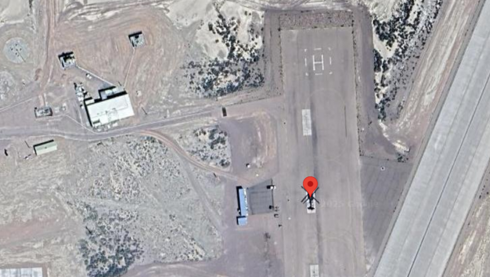

## Synopsis

In the highest tower of Eldoria's archives, Nyla manipulates a crystal scrying glass, focusing on a forbidden fortress in the desert kingdoms. The Queen's agents have discovered a strange mechanical bird within the fortress walls—an unusual flying machine whose exact position could reveal strategic secrets. Nyla's fingers trace precise measurement runes across the crystal's surface as the aerial image sharpens. Her magical lattice grid overlays the vision, calculating exact distances and positions. The blue runes along her sleeves pulse rhythmically as coordinates appear in glowing script. Another hidden truth uncovered by the realm's premier information seeker, who knows that even the most distant secrets cannot hide from one who sees with magical precision.

## Challenge Description

A high-resolution satellite scan of Area 51 has captured an unidentified helicopter within a secure perimeter. Your objective is to locate this aircraft using publicly available satellite imagery and determine its precise latitude and longitude. By cross-referencing the image with Google Maps, you can identify the helicopter’s position and extract its coordinates.

## Solve

### Enumeration
Based on the prompt mentioning, flying machines and fortress walls my brain first went to looking for military bases. I had to admit it but this was one of our last OSINT solves as I assumed Area 51 had be blurred out on images and I was searching everywhere else and I ended up skipping the question.

### Step 1

After navigating to area 51, you have to scan over the respective area until you pinpointed the helicopter.
### Step 2 

Once you found the helicopter and copied the coordinates they were in the wrong format the flag was asking for. I am not going to lie I hucked it into a LLM to convert it on over to submit the flag.

