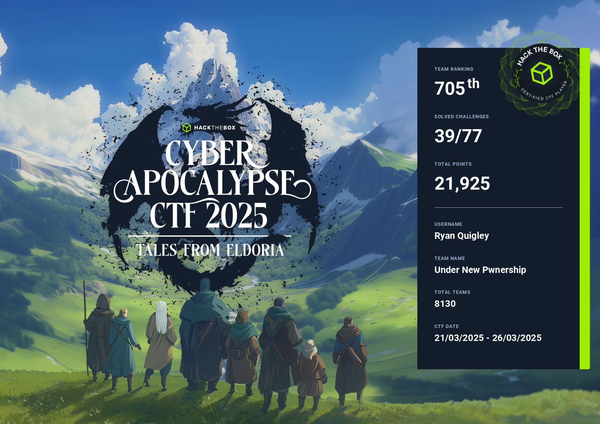

# **Cyber Apocalypse 2025 Summary:**

Cyber Apocalypse 2025 represented my first significant participation in a Capture the Flag (CTF) competition. With 18,369 players across 8,129 teams, it was a massive event, and I saw it as an ideal opportunity to test and expand my cybersecurity knowledge. More than just a competition, it was an invaluable learning experience, allowing me to assess my current skills in a practical and challenging environment. The diverse range of challenges pushed me to explore new techniques and problem-solving approaches, solidifying my understanding of various cybersecurity concepts.

## My Experience
I joined forces with a team of coworkers and friends, and together, we tackled the challenges of Cyber Apocalypse 2025. We managed to solve 39 out of the 77 total flags, ultimately placing 705th out of 8,129 teams, which positioned us within the top 9% of participating groups. I was particularly proud of my contribution as the team's leading solver, personally securing 21 flags, representing over 53% of our total solves. Beyond my individual efforts, I also dedicated time to assist our less experienced team members, guiding them towards successfully capturing their first flags and contributing to the team's overall success.

I demonstrated particular strength in several categories, excelling in forensics, OSINT, coding, and AI challenges. These areas allowed me to capitalize on my skills and problem-solving abilities. Notably, I directly contributed to or assisted in two top 10 solves: 'Poison Scrolled,' which I personally submitted as the 9th solve, and 'Hillside Haven,' where I provided crucial assistance, resulting in a 7th place solve. Additionally, I achieved a 29th place solve for 'Ancient Citadel,' a result that would have placed within the top 10 had I managed to correctly format the flag submission. These accomplishments underscored my ability to tackle complex challenges and highlighted my individual contributions to our overall success.

Despite not having a formal computer science background, I dedicated significant effort to the Reverse Engineering and PWN challenges, viewing them as valuable learning opportunities. This experience provided me with a practical introduction to assembly language and machine-level code. Specifically, I gained insights into assembly concepts such as the general architecture of stack-based overflows, and the function of stack canaries. Furthermore, I developed a foundational understanding of debugging assembly code, a skill crucial for analyzing and exploiting software vulnerabilities. While these challenges proved difficult, they sparked a strong desire to further develop my skillset in these areas, and I intend to dedicate future learning to mastering these categories.

## Summary
Cyber Apocalypse 2025 was a highly valuable learning experience, representing my first serious engagement in a CTF Competition. Contributing significantly to my team's top 9% placement, and achieving top 10 solves in OSINT and notable solves in other categories. The challenges outside my core skillset, particularly Reverse Engineering and PWN, provided significant learning opportunities regarding assembly and machine-level code. I'm eager to continue developing my abilities in these areas and look forward to participating in future CTFs to further enhance my expertise.

