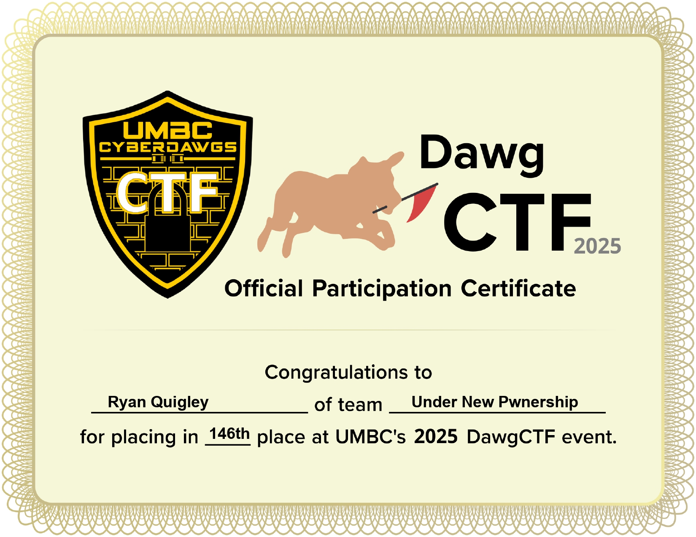

# About
This repository contains my personal write-up for DawgCTF 2025, the annual Capture The Flag competition hosted by the University of Maryland, Baltimore County (UMBC). DawgCTF is a beginner-friendly competition aimed primarily at college students, though it's open to the public.

## Timeframe
Although the competition spanned an entire weekend (Friday to Sunday), I joined late on Saturday. Despite the limited time, I was able to dive into a variety of challenges across multiple categories, including:
- Forensics
- Cryptography
- OSINT
- PWN
- Miscellaneous

## Results
Out of 1,208 registered participants, with some light collaboration from two friends (particularly on a few OSINT challenges), our team managed to place 146th overall. While it’s not a podium finish, it’s within the top 12% of competitors, especially considering the short time I had to participate.

## Skills & Takeaways
DawgCTF proved to be a great learning experience. Some of the interesting techniques I explored included:
- Extracting hidden data from URG pointers in TCP transmissions
- Reading Smartcard PINs through USB communication analysis
- And much more...

Overall, it was a fun and rewarding experience that strengthened my CTF skills and taught me a variety of new techniques across disciplines.

