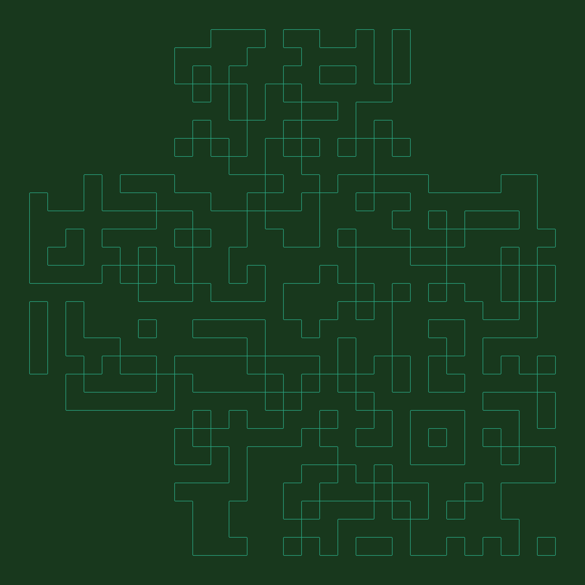

# About
Later on the hike, n00psy takes you to a place he really likes: a maze!

## Provided Source


My first gut instinct was this is supposed to be a QR code based on the blocky ness but its missing the eyes in the corners. If we convert to black and white it starts looking more like a QR code.


The part of the challenge which will prove difficult is actually filling in where we are supposed to. We know this image is missing the QR "eyes" but we at least have the one in the bottom we can fill in.


Filling it to make it legible gets a decent chunk filled in. Lets add a 25x25 grid and see if that helps us to fill the rest of this out. I imported it into gimp, and followed this [guide](https://adamfontenot.com/post/fixing_a_broken_qr_code_in_fez) on how to rebuild QR codes. 


After some trial and error I got a QR code that was able to scan and give us the flag.

```
N0PS{7hI5_1s_R3a1Ly_4_Qr_C0d3}
```
