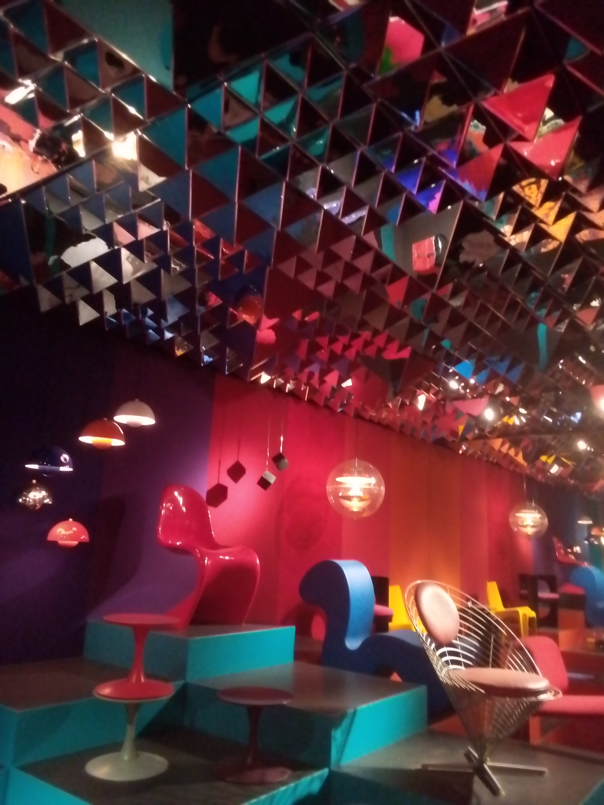

# About
It's finally time to dive into the fascinating world of [OSINT](https://en.wikipedia.org/wiki/Open-source_intelligence), that magical word that excites digital detectives and gives regular folks the chills. Today, we’ll be starting with the baaasic stuff: just a bit of reverse image searching to warm up!

Now, story time: Alice has stumbled into N0PStopia and found herself in a surreal place, lined entirely with chairs. 🪑

Will you be able to figure out where this tunnel is, when it opened, and, just for fun, how many chairs are in there? It seemed like it stretches into infinity.. x)

Flag format : `B4BY{Place-Location_Opening-Date_chairs-number}`

Example : `B4BY{Lectures-Tower-N0PSTopia_June-1st-2025_505}`

Note : Make sure all the parts of your flag (even country names) are in English.


# Solve



Reverse image searching this gets us the Designmuseum in Denmark. Going to their website we find that this is apart of the "Danish Modern" exhibition that opened on June 7, 2024. It also mentions the amount of chairs being 125.

```
B4BY{Designmuseum-Denmark_June-7th-2024_125}
```

Quite an easy quick win.