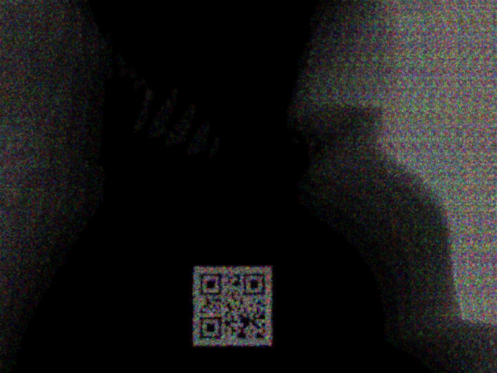

# About
Bad Apple! A classic example used as a proof of concept to demonstrate the ability to display a sequence of black-and-white images in virtually any medium---oscilloscopes, mechanical flip dots, electronic billboards, or this CTF challenge. It's kind of like Doom, which is famously used as a benchmark to prove that a given device can run code. Bad Apple, on the other hand, is often used to prove that anything capable of rendering black and white can play a video.
[Provided Video](https://www.youtube.com/watch?v=cAQyX-i4jyY)
## Skills learned
- Frame diffing with OpenCV
- Image averaging and overlay logic
- Batch processing with memory management
- Parallel processing using `concurrent.futures`
- Barcode decoding attempts via `pyzbar`
- Conversion to binary/black-and-white images to clean up noise
- Video Steganography
## Rough Notes/Solve
Download the video with youtube-dl

grab the frames from the video `ffmpeg -i video.mp4 -vf fps=30 frame_%04d.png`

write a quick script to analyze frame differences
```python
import cv2
import numpy as np
import glob

# Load all frames
frames = [cv2.imread(f) for f in sorted(glob.glob("frame_*.png"))]

# Create differences between consecutive frames
differences = [cv2.absdiff(frames[i], frames[i+1]) for i in range(len(frames)-1)]

# Save or visualize differences
for i, diff in enumerate(differences):
    cv2.imwrite(f"diff_{i:04d}.png", diff)
```

There is a barcode that moves around but its not in one position so we have to track the Barcode and try and get a better image

Initial decode trying to decode the first 38 frames as it stays in the same place.
```python
import cv2
import numpy as np
import glob
from pyzbar.pyzbar import decode
from PIL import Image

# Load all frames
frames = [cv2.imread(f) for f in sorted(glob.glob("frame_*.png"))]

# Choose the first 38 frames for averaging differences
frame_count = 38

# Initialize an empty array to accumulate differences
accumulated_diff = np.zeros_like(frames[0], dtype=np.float32)

# Accumulate the differences between frames 1-38
for i in range(1, frame_count):
    diff = cv2.absdiff(frames[i-1], frames[i])
    accumulated_diff += np.float32(diff)

# Average the accumulated differences
accumulated_diff /= frame_count - 1

# Convert the accumulated difference to uint8
accumulated_diff = np.uint8(cv2.normalize(accumulated_diff, None, 0, 255, cv2.NORM_MINMAX))

# Preprocess: Convert to grayscale and apply thresholding for barcode visibility
gray_accumulated_diff = cv2.cvtColor(accumulated_diff, cv2.COLOR_BGR2GRAY)
_, thresholded_diff = cv2.threshold(gray_accumulated_diff, 100, 255, cv2.THRESH_BINARY)

# Optionally save or display the thresholded image
cv2.imwrite("accumulated_thresholded_diff.png", thresholded_diff)

# Decode the barcode from the processed image
image = Image.fromarray(thresholded_diff)
decoded_objects = decode(image)

# Print barcode data if found
for obj in decoded_objects:
    print("Type:", obj.type)
    print("Data:", obj.data.decode('utf-8'))

```
With this script I got the letter "B" and realized this was not going to be easy as it looks. I then realized when taking a deeper look at the diffs the barcode was roughly moving every 13 frames. Since there was so much noise in order to fully make a readable barcode I had to stack the 13 frames before it moved in order to get a read. Turns out this is easier said then done, and scripting it was another problem. 

After some time I was able to start making some human readable barcodes with some really jank coding courtesy of LLM's.
```
import os
from PIL import Image
import numpy as np
import concurrent.futures
import time
import gc

# Define a worker function that processes images one at a time to save memory
def process_batch(batch_data):
    batch_index, batch_files, input_dir, output_dir, base_size = batch_data
    
    if not batch_files:
        return None
    
    try:
        # Initialize accumulator array (single image sized)
        # We'll build our average incrementally to avoid loading all images at once
        first_img = Image.open(os.path.join(input_dir, batch_files[0])).convert("RGBA").resize(base_size)
        accumulator = np.zeros((base_size[1], base_size[0], 4), dtype=np.float64)
        
        # Process one image at a time
        for img_file in batch_files:
            # Open, resize and convert to array
            img_path = os.path.join(input_dir, img_file)
            with Image.open(img_path).convert("RGBA") as img:
                img = img.resize(base_size)
                # Add to accumulator (no need to store all images in memory)
                accumulator += np.array(img, dtype=np.float64)
                
                # Force cleanup
                img = None
                gc.collect()
        
        # Calculate average
        accumulator /= len(batch_files)
        composite = accumulator.astype(np.uint8)
        
        # Convert back to image
        final_image = Image.fromarray(composite, mode='RGBA')
        
        # Save output
        output_path = os.path.join(output_dir, f"overlay_{batch_index}.png")
        final_image.save(output_path)
        
        # Force cleanup
        accumulator = None
        composite = None
        final_image = None
        gc.collect()
        
        return batch_index
    except Exception as e:
        print(f"Error processing batch {batch_index}: {str(e)}")
        return None

# Main function
def main():
    start_time = time.time()
    
    # Parameters
    input_dir = "diff"
    output_dir = "overlay_output"
    batch_size = 13
    
    # Limit max workers to prevent memory overload
    # Adjust this based on your machine's capabilities
    max_workers = 8  # Reduced from default (CPU count)
    
    # Ensure output directory exists
    os.makedirs(output_dir, exist_ok=True)
    
    # Collect and sort image files
    image_files = sorted([
        f for f in os.listdir(input_dir)
        if f.startswith("diff_") and f.endswith(".png")
    ], key=lambda x: int(x.split("_")[-1].split(".")[0]))
    
    if not image_files:
        print("No images found in the input directory.")
        return
    
    print(f"Found {len(image_files)} images to process")
    
    # Get base size from first image
    with Image.open(os.path.join(input_dir, image_files[0])) as base_img:
        base_size = base_img.size
    
    # Prepare batches
    batch_args = []
    for i in range(0, len(image_files), batch_size):
        batch = image_files[i:i + batch_size]
        batch_args.append((i // batch_size, batch, input_dir, output_dir, base_size))
    
    total_batches = len(batch_args)
    processed_batches = 0
    
    print(f"Processing {total_batches} batches with {max_workers} worker processes")
    
    # Process batches in parallel with limited workers
    with concurrent.futures.ProcessPoolExecutor(max_workers=max_workers) as executor:
        # Submit all tasks
        future_to_batch = {executor.submit(process_batch, batch_arg): batch_arg[0] for batch_arg in batch_args}
        
        # Process results as they complete
        for future in concurrent.futures.as_completed(future_to_batch):
            batch_index = future_to_batch[future]
            try:
                result = future.result()
                if result is not None:
                    processed_batches += 1
                print(f"Progress: {processed_batches}/{total_batches} batches processed", end='\r')
            except Exception as e:
                print(f"Batch {batch_index} generated an exception: {str(e)}")
    
    print("\n")  # New line after progress reporting
    
    elapsed_time = time.time() - start_time
    print(f"Overlay complete! Processed {processed_batches}/{total_batches} batches in {elapsed_time:.2f} seconds")

if __name__ == "__main__":
    main()
```

The above script was producing barcodes that appeared readable but in reality they were not.... After some time I decided to convert to black and white for further processing then overlay them again
```
import os
from PIL import Image
import numpy as np
import concurrent.futures
import time
import gc

# Define a worker function that processes images one at a time to save memory
def process_batch(batch_data):
    batch_index, batch_files, input_dir, output_dir, base_size = batch_data
    
    if not batch_files:
        return None
    
    try:
        # Initialize accumulator array (single image sized)
        # We'll build our average incrementally to avoid loading all images at once
        first_img = Image.open(os.path.join(input_dir, batch_files[0])).convert("RGBA").resize(base_size)
        accumulator = np.zeros((base_size[1], base_size[0], 4), dtype=np.float64)
        
        # Process one image at a time
        for img_file in batch_files:
            # Open, resize and convert to array
            img_path = os.path.join(input_dir, img_file)
            with Image.open(img_path).convert("RGBA") as img:
                img = img.resize(base_size)
                # Add to accumulator (no need to store all images in memory)
                accumulator += np.array(img, dtype=np.float64)
                
                # Force cleanup
                img = None
                gc.collect()
        
        # Calculate average
        accumulator /= len(batch_files)
        composite = accumulator.astype(np.uint8)
        
        # Convert back to image
        final_image = Image.fromarray(composite, mode='RGBA')
        
        # Save output
        output_path = os.path.join(output_dir, f"overlay_{batch_index}.png")
        final_image.save(output_path)
        
        # Force cleanup
        accumulator = None
        composite = None
        final_image = None
        gc.collect()
        
        return batch_index
    except Exception as e:
        print(f"Error processing batch {batch_index}: {str(e)}")
        return None

# Main function
def main():
    start_time = time.time()
    
    # Parameters
    input_dir = "black_and_white_diffs"
    output_dir = "black_and_white_overlay_output"
    batch_size = 13
    
    # Limit max workers to prevent memory overload
    # Adjust this based on your machine's capabilities
    max_workers = 8  # Reduced from default (CPU count)
    
    # Ensure output directory exists
    os.makedirs(output_dir, exist_ok=True)
    
    # Collect and sort image files
    image_files = sorted([
        f for f in os.listdir(input_dir)
        if f.startswith("diff_") and f.endswith(".png")
    ], key=lambda x: int(x.split("_")[-1].split(".")[0]))
    
    if not image_files:
        print("No images found in the input directory.")
        return
    
    print(f"Found {len(image_files)} images to process")
    
    # Get base size from first image
    with Image.open(os.path.join(input_dir, image_files[0])) as base_img:
        base_size = base_img.size
    
    # Prepare batches
    batch_args = []
    for i in range(0, len(image_files), batch_size):
        batch = image_files[i:i + batch_size]
        batch_args.append((i // batch_size, batch, input_dir, output_dir, base_size))
    
    total_batches = len(batch_args)
    processed_batches = 0
    
    print(f"Processing {total_batches} batches with {max_workers} worker processes")
    
    # Process batches in parallel with limited workers
    with concurrent.futures.ProcessPoolExecutor(max_workers=max_workers) as executor:
        # Submit all tasks
        future_to_batch = {executor.submit(process_batch, batch_arg): batch_arg[0] for batch_arg in batch_args}
        
        # Process results as they complete
        for future in concurrent.futures.as_completed(future_to_batch):
            batch_index = future_to_batch[future]
            try:
                result = future.result()
                if result is not None:
                    processed_batches += 1
                print(f"Progress: {processed_batches}/{total_batches} batches processed", end='\r')
            except Exception as e:
                print(f"Batch {batch_index} generated an exception: {str(e)}")
    
    print("\n")  # New line after progress reporting
    
    elapsed_time = time.time() - start_time
    print(f"Overlay complete! Processed {processed_batches}/{total_batches} batches in {elapsed_time:.2f} seconds")

if __name__ == "__main__":
    main()
```

This iteration was better than the last and we started to consistently get more reads. Using the following barcode scanner script and a bit of luck in my output I was able to find the flag start and end of the flag format starting with "P" and ending with a "}"
```
import cv2
import os
from pyzbar.pyzbar import decode

def detect_qr_codes(image_path):
    try:
        img = cv2.imread(image_path)
        if img is None:
            print(f"Error: Could not read image at {image_path}")
            return []

        gray = cv2.cvtColor(img, cv2.COLOR_BGR2GRAY)
        blur = cv2.GaussianBlur(gray, (5, 5), 0)
        _, thresh = cv2.threshold(blur, 100, 255, cv2.THRESH_BINARY)
        adaptive_thresh = cv2.adaptiveThreshold(gray, 255, cv2.ADAPTIVE_THRESH_GAUSSIAN_C, cv2.THRESH_BINARY, 11, 2)
        inverted = cv2.bitwise_not(thresh)
        resized = cv2.resize(gray, None, fx=2, fy=2, interpolation=cv2.INTER_CUBIC)

        images = [img, gray, thresh, adaptive_thresh, inverted, resized]
        decoded_data = []

        for image in images:
            decoded_objects = decode(image)
            for obj in decoded_objects:
                data = obj.data.decode('utf-8')
                if data not in decoded_data: #prevent duplicates.
                    decoded_data.append(data)

        return decoded_data

    except Exception as e:
        print(f"An error occurred while processing {image_path}: {e}")
        return []

def process_directory(directory_path):
    if not os.path.exists(directory_path):
        print(f"Error: Directory {directory_path} does not exist.")
        return

    for filename in os.listdir(directory_path):
        if filename.lower().endswith(('.png', '.jpg', '.jpeg', '.bmp', '.tiff', '.tif')):
            image_path = os.path.join(directory_path, filename)
            decoded_data = detect_qr_codes(image_path)

            if decoded_data:
                print(f"QR codes found in {filename}:")
                for data in decoded_data:
                    print(f"  - {data}")
            else:
                print(f"No QR codes found in {filename}")

directory = "blackAndWhiteFlagOverlay"
process_directory(directory)
```

After finding which frame overlays contained the flag I was able to only look at those overlays and proceed to dig deeper. Wasn't getting consistent reads and was really bashing my head.
```
PCTF{_spy_with_my_little_eye__ece_of_vision_c32392f3e832741a5a3}
```
In collaboration with one of my teammates we were able to take all of the unscanned QR codes and essentially brute force the remaining parts of the flag as we had basically assembled the entire alphabet to plug and chug the remainder
```
PCTF{i_spy_with_my_little_eye_persistence_of_vision_c32392f3e83c2741a5a3}
```
### Intended Solve
```
from PIL import Image, ImageChops
import os
import shutil
from os.path import join as path_join
import tqdm
import cv2
import qreader
import numpy as np

frames = sorted(os.listdir("frames"))
shutil.rmtree("output", ignore_errors=True)
os.makedirs("output")

# Looked up the bpm online, fps from the file
bpm = 138
fps = 30

def generate_frame_chunks(frames):
	tokens = 0
	index = 0
	while index < len(frames):
		tokens += 60 / bpm * fps
		yield frames[index:index+int(tokens)]
		index += int(tokens)
		tokens -= int(tokens)

frames = frames[1:]
chunks = list(generate_frame_chunks(frames))

print("making the qr code reader")
reader = qreader.QReader()
output = ""
last_outs = set()

for chunk in tqdm.tqdm(chunks):
	# I happen to know that the flag is in this part :)
	# if chunk[-1] < "06431" or chunk[-1] > "07370":
	# 	continue

	images = [Image.open(path_join("frames", frame)) for frame in chunk]
	diffs = []
	for step in (range(1, len(images)) if fast_mode else [1]):
		diffs += [ImageChops.difference(images[j], images[j+step]) for j in range(len(images)-step)]

	# convert to a single np array
	arr = np.array([np.array(diff) for diff in diffs])
	# threshold all channels
	arr = np.where(arr > 100, 255, 0)
	# flatten to grayscale, take max of all channels on each pixel
	arr = np.max(arr, axis=3)
	# sum all frames
	arr = np.sum(arr, axis=0)
	# scale to 0-255
	max = np.max(arr)
	arr = (arr / max * 255).astype(np.uint8)
	avgdiff = Image.fromarray(arr)
	# make sure it's a grayscale image
	avgdiff = avgdiff.convert("L")

	# save the image
	avgdiff.save(path_join("output", chunk[-1]))

	# read into cv2
	img = cv2.imread(path_join("output", chunk[-1]))
	gray = cv2.cvtColor(img, cv2.COLOR_BGR2GRAY)

	# read qr code
	detected = set(det for det in reader.detect_and_decode(gray) if det is not None)
	if len(detected) == 1:
		output += next(iter(detected))
	else:
		output += "\x1b[31m?\x1b[0m"
	print(output, detected, chunk[-1])

```